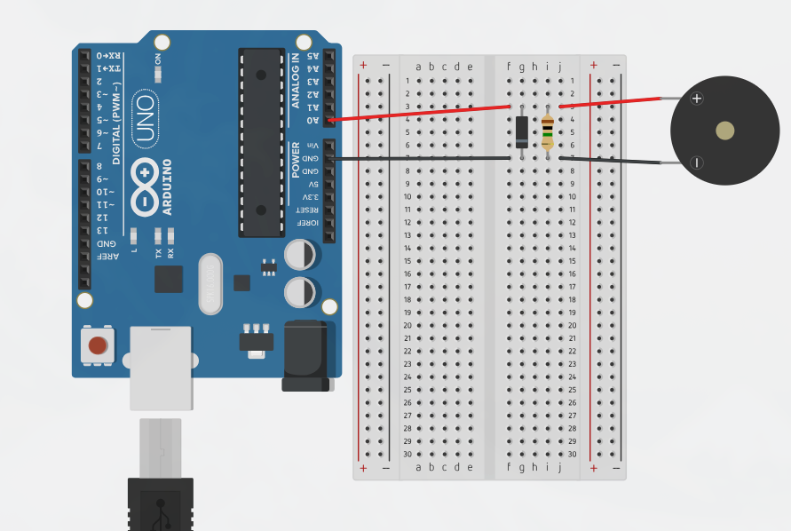

# ProtoPET

O ProtoPET é uma atividade dedicada ao desenvolvimento prático de aplicações em **Sistemas Embarcados**. Nosso foco é a criação de protótipos funcionais que resolvam problemas reais, promovendo a integração entre teoria e prática.

# PETDrums

Este consiste em um projeto que visa fazer uma bateria eletrônica

Instale o `ttymidi` para criar uma porta MIDI virtual, conecte o Arduino e veja 
qual o porta está sendo usada em `/dev`. Depois dê o seguinte comando:

```
ttymidi -s /dev/ttyUSB0 -b 115200
```

O software usado é o `Hydrogen`



# TimBot

rato
