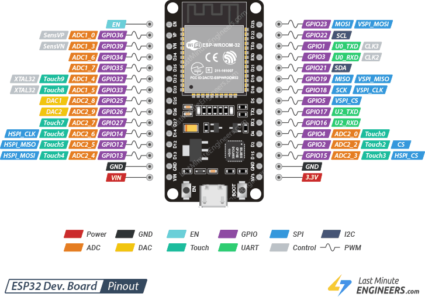
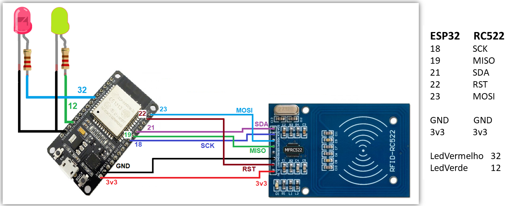

# ESP32 Dev Board 

O ESP32 possui diversos pinos que podem assumir diferentes funções.

<p align="center">
  
</p>

---

## Energia

| Pino  | Tensão | Descrição |
|-------|--------|-----------|
| `VIN` | 5V     | Alimenta a placa quando não estiver conectada via USB. Passa pelo regulador interno e vira 3.3V. |
| `3.3V`| 3.3V   | Saída regulada para alimentar sensores e módulos externos. Corrente máxima: ~600 mA total. |
| `GND` | 0V     | Terra do circuito. Todo componente precisa de um fio aqui para fechar o circuito. |
| `EN`  | —      | Pino de enable (reset). Ao receber LOW, reinicia o ESP32. |

---

## GPIO: General Purpose Input/Output

Quase todos os pinos do ESP32 são GPIOs, o que significa que, via código, você pode dizer se eles vão:

### Saída: Acionar algo

Use para acender um LED, acionar um relé, abrir uma tranca elétrica, etc.

```cpp
	pinMode(pino, OUTPUT);
	digitalWrite(pino, HIGH);  // Liga
	digitalWrite(pino, LOW);   // Desliga 
```

### Entrada: Ler algo

Use para ler o estado de um botão, sensor de presença, fim de curso, etc.

```cpp
	pinMode(pino, INPUT);           // Sem resistor interno
	int estado = digitalRead(pino); // Retorna HIGH (1) ou LOW (0)
```

---

## Comunicação

O ESP32 suporta vários protocolos para conversar com sensores e módulos.

### SPI: Serial Peripheral Interface

Comunicação rápida, usada com módulos como o leitor RFID RC522, displays TFT e cartões SD.

| Função | Pino (VSPI) | Pino (HSPI) |
|--------|-------------|-------------|
| MOSI   | GPIO 23     | GPIO 13     |
| MISO   | GPIO 19     | GPIO 12     |
| SCK    | GPIO 18     | GPIO 14     |
| CS/SS  | GPIO 5      | GPIO 15     |

<p align="center">
  
</p>

---

### I2C: Inter-Integrated Circuit

Usa apenas **dois fios** e permite conectar vários dispositivos no mesmo barramento. Ideal para displays OLED, sensores de temperatura/umidade e acelerômetros.

| SDA possíveis | SCL possíveis |
| ------------- | ------------- |
| GPIO 21 (Padrão) | GPIO 22 (Padrão) |
| GPIO 25       | GPIO 26       |
| GPIO 32       | GPIO 33       |
| GPIO 16       | GPIO 17       |
| GPIO 4        | GPIO 15       |


### UART: Universal Asynchronous Receiver/Transmitter

É a comunicação serial. A UART0 é usada para programar o ESP32 e receber mensagens de debug pelo cabo USB.

| UART  | TX     | RX     | Uso               |
|-------|--------|--------|-------------------|
| UART0 | GPIO 1 | GPIO 3 | Debug / USB (evite em projetos) |
| UART2 | GPIO 17| GPIO 16| Livre para uso    |


---

## ADC: Analógico para Digital

Enquanto os pinos digitais só entendem **ligado ou desligado** (0 ou 1), os pinos ADC leem variações contínuas de tensão. Resolução de **12 bits** (valores de 0 a 4095) com tensão de referência de 3.3V.

### ADC1 

Funciona normalmente **mesmo com Wi-Fi ativo**.

### ADC2 

**Não funciona corretamente quando o Wi-Fi está ativo.** Use apenas em projetos sem Wi-Fi.

```cpp
  int leitura = analogRead(34);              // Lê o GPIO34
  float tensao = leitura * 3.3 / 4095.0;    // Converte para tensão
  Serial.println(tensao);
```

---

## DAC: Digital para Analógico

O ESP32 tem 2 pinos que geram uma tensão analógica **real** (não PWM), com resolução de **8 bits** (0 a 255, que corresponde a 0 a 3.3V).

| Canal | GPIO |
|-------|------|
| DAC1  | 25   |
| DAC2  | 26   |

```cpp
  dacWrite(25, 128); // ~1.65V no GPIO25
  dacWrite(26, 255); // ~3.3V no GPIO26
  dacWrite(25, 0);   // 0V no GPIO25
```

**Quando usar:** geração de sinal de áudio simples, tensão de referência variável.

---

## PWM: Pulse Width Modulation

Vários pinos do ESP32 suportam PWM, uma técnica que "pisca" a energia muito rápido para simular tensões intermediárias. Usado para controlar brilho de LEDs e velocidade de motores.


## Touch Capacitivo

Dez pinos do ESP32 possuem sensores capacitivos embutidos — eles detectam o toque do dedo direto no fio ou em uma plaquinha de cobre, sem precisar de botão físico.


```cpp
	int valor = touchRead(4); // Lê o Touch0 no GPIO4
```

---

## Boot: Modos de Inicialização

O ESP32 usa alguns pinos para decidir o que fazer ao ligar. Na maioria das vezes isso é automático, mas é bom entender para evitar problemas.

| Pino  | Boot Normal | Boot Flash (Programação) |
|-------|-------------|--------------------------|
| GPIO0 | HIGH (pull-up) | LOW |
| GPIO2 | LOW ou flutuante | — |

No Dev Board, o botão **BOOT** mantém o GPIO0 em LOW enquanto pressionado, colocando o chip no modo de gravação. O botão **EN** reinicia o chip.

>Se o ESP32 não entrar no modo de gravação automaticamente, segure o botão BOOT antes de clicar em Upload na IDE.
